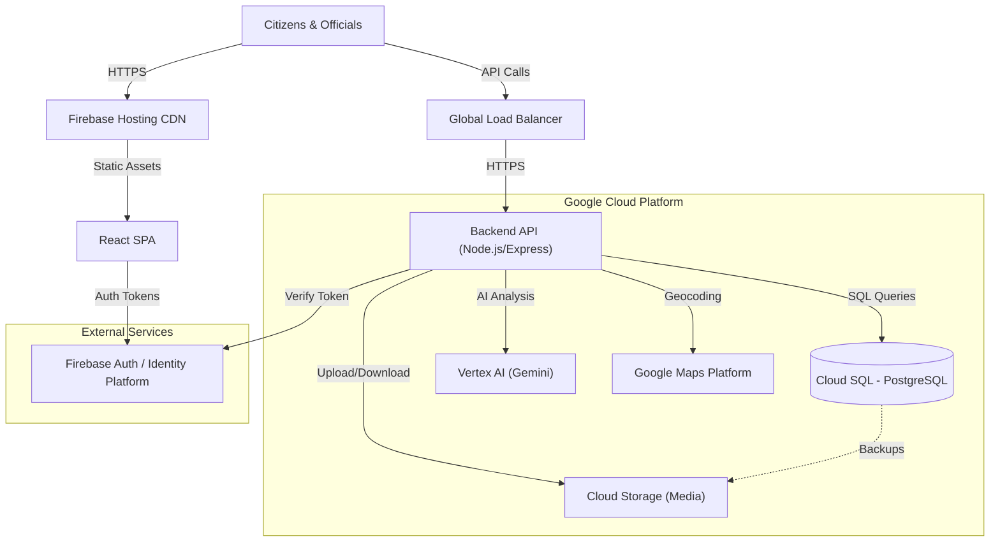
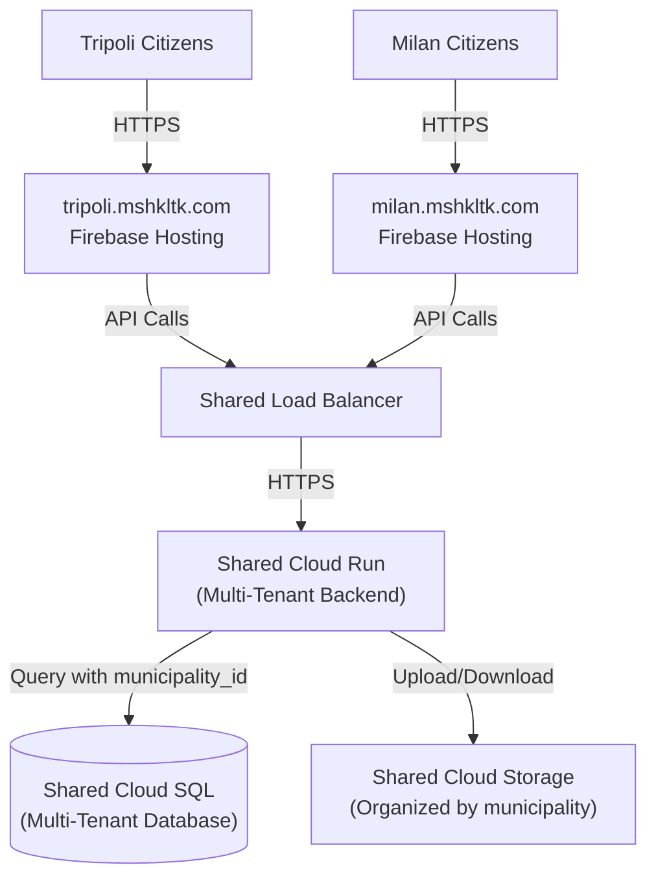

# 🏗️ GCP Architecture Design - Mshkltk

**Document:** Technical Architecture Specification  
**Status:** Recommended Target Architecture  
**Date:** November 25, 2025  

---

## 🎯 Executive Summary

The recommended architecture for Mshkltk is a **Serverless Container** approach using **Cloud Run** and **Cloud SQL**.

**Why this choice?**
The current application is built with **Node.js/Express** and **PostgreSQL**. 
- **Cloud Run** allows us to deploy the existing backend container without rewriting code for a proprietary FaaS (Function-as-a-Service) platform.
- **Cloud SQL** provides a managed PostgreSQL environment that matches the local development database perfectly.
- **Firebase Hosting** offers a global CDN for the React frontend with zero maintenance.

This architecture offers the **lowest engineering effort** to migrate while providing **enterprise-grade scalability** from day one.

---

## 📐 High-Level Architecture Diagram



---

## 🧩 Component Overview

| Component | GCP Service | Purpose in Mshkltk | Key Benefits |
|-----------|-------------|--------------------|--------------|
| **Frontend** | **Firebase Hosting** | Hosts the React (Vite) application and static assets. | Global CDN, free SSL, atomic deployments, zero-config. |
| **Backend** | **Cloud Run** | Runs the Node.js Express API in a stateless container. | Auto-scales to zero (cost-saving), handles concurrent requests, no server management. |
| **Database** | **Cloud SQL** | Managed PostgreSQL 15+ database with PostGIS extension. | Fully managed, automated backups, high availability, PostGIS support for maps. |
| **Storage** | **Cloud Storage** | Stores user-uploaded photos and videos. | Infinite scale, low cost, integrates with Cloud CDN. |
| **Auth** | **Identity Platform** | Manages user sign-up, login, and JWT tokens. | Secure, handles 2FA/social login, free tier is generous (Firebase Auth). |
| **AI** | **Vertex AI** | Access to Gemini models for text/image analysis. | Enterprise-grade reliability, data privacy compliance, low latency. |
| **Maps** | **Maps Platform** | Geocoding, reverse geocoding, and map visualization. | Industry standard, high accuracy for civic data. |

---

## 🛠️ Detailed Design

### 1. Compute: Cloud Run (Backend)
Instead of managing VMs (Compute Engine) or rewriting for Cloud Functions, we use **Cloud Run**.
- **Containerization:** The existing `Dockerfile` is used to build the image.
- **Scaling:** Configured to scale from **0 to N** instances based on CPU/request load.
- **Cost Efficiency:** You only pay when a request is being processed. If no one uses the app at 3 AM, cost is zero.
- **Configuration:** Secrets (DB passwords, API keys) are injected via **Secret Manager**.

### 2. Database: Cloud SQL (PostgreSQL)
- **Engine:** PostgreSQL 15.
- **Extensions:** `PostGIS` enabled for geospatial queries (finding reports within radius).
- **Instance Type:** 
  - *Pilot:* `db-f1-micro` or `db-custom-1-3840` (Shared core, low cost).
  - *Production:* `db-custom-2-8192` (Dedicated vCPUs) with High Availability (HA).
- **Connection:** Backend connects via **Cloud SQL Auth Proxy** (built into Cloud Run) for secure, password-less IAM authentication (recommended) or standard connection string.

### 3. Storage: Cloud Storage
- **Bucket Structure:**
  - `/uploads/reports/{reportId}/{filename}`
  - `/uploads/avatars/{userId}/{filename}`
- **Security:**
  - Buckets are **private** by default.
  - Backend generates **Signed URLs** for uploads (PUT) and downloads (GET). This prevents public scraping and controls access time.

### 4. Authentication: Identity Platform (Firebase Auth)
*Note: The current codebase uses custom JWT. Migration to Firebase Auth is recommended for security.*
- **Flow:**
  1. Frontend authenticates user with Firebase SDK (Google Sign-In, Email/Pass).
  2. Firebase returns an ID Token (JWT).
  3. Frontend sends ID Token in `Authorization` header to Cloud Run.
  4. Cloud Run verifies token using Firebase Admin SDK.
- **Why:** Offloads complexity of password hashing, session management, and security patches.

### 5. AI & Maps Integration
- **Vertex AI:** The backend calls Vertex AI API for:
  - **Triage:** Analyzing report text/images to suggest categories.
  - **Moderation:** Detecting inappropriate content before publishing.
- **Google Maps:**
  - **Frontend:** Maps JavaScript API for interactive maps.
  - **Backend:** Geocoding API to convert addresses to coordinates (and vice versa).

---

## 🛡️ Security & Compliance

- **Network Security:** 
  - Cloud Run services are deployed with HTTPS enabled by default.
  - Cloud SQL is configured with a **Private IP** to ensure database traffic never leaves the internal VPC network.
- **Data Residency:** 
  - All resources (Cloud Run, SQL, Storage) will be pinned to a specific region (e.g., `europe-west1` for GDPR compliance or closest proximity to users).
- **Least Privilege:** 
  - The Cloud Run service account has minimal permissions (only `cloudsql.client`, `storage.objectAdmin`, `aiplatform.user`).

---

## 🏢 Multi-Tenant Architecture (Multiple Cities, Shared Backend)

Mshkltk is designed to serve **multiple cities** (Tripoli, Milan, etc.) using a **shared backend** with **city-specific frontends**.

### Architecture Model:



### Database Multi-Tenancy:

All cities share the same database, with data isolated by `municipality_id`:

```sql
-- Every table has municipality_id
CREATE TABLE reports (
  id SERIAL PRIMARY KEY,
  municipality_id VARCHAR(50) NOT NULL,  -- 'tripoli', 'milan', etc.
  title TEXT,
  category VARCHAR(100),
  location GEOGRAPHY(POINT),
  status VARCHAR(50),
  created_at TIMESTAMP DEFAULT NOW(),
  ...
);

CREATE INDEX idx_reports_municipality ON reports(municipality_id, created_at);

-- Row-Level Security (optional for extra safety)
ALTER TABLE reports ENABLE ROW LEVEL SECURITY;
CREATE POLICY municipality_isolation ON reports
  FOR ALL
  USING (municipality_id = current_setting('app.current_municipality'));
```

### Frontend Isolation:

Each city gets its own Firebase Hosting deployment:

```yaml
# Tripoli Frontend
Domain: tripoli.mshkltk.com
Environment Variables:
  VITE_MUNICIPALITY_ID: "tripoli"
  VITE_API_URL: "https://api.mshkltk.com"
  VITE_PRIMARY_COLOR: "#00A86B"  # Lebanon green

# Milan Frontend  
Domain: milan.mshkltk.com
Environment Variables:
  VITE_MUNICIPALITY_ID: "milan"
  VITE_API_URL: "https://api.mshkltk.com"
  VITE_PRIMARY_COLOR: "#E30613"  # Milan red
```

### Benefits:

✅ **Cost Efficiency:** Shared Cloud Run + Cloud SQL (no duplicate infrastructure)  
✅ **Economies of Scale:** Database connection pooling, shared caching  
✅ **Easy Maintenance:** One codebase, one deployment pipeline  
✅ **City Branding:** Each city gets custom domain, colors, logos  
✅ **Data Isolation:** `municipality_id` ensures data never mixes  
✅ **Easy to Add Cities:** Just deploy a new frontend, no backend changes  

### Cost Impact:

- **Adding a new city:** Only incremental costs (Maps, AI, Storage for that city's users)
- **No additional:** Cloud Run, Cloud SQL, or infrastructure costs
- **Example:** Tripoli (€266/month) + Milan (€2,268/month) = **€2,534/month total** (not €2,534 × 2)

---

## 🚀 Deployment Pipeline (CI/CD)

We will use **Cloud Build** triggered by GitHub pushes:

1. **Push to `main` branch.**
2. **Cloud Build triggers:**
   - Builds the Docker container.
   - Pushes image to **Artifact Registry**.
   - Applies database migrations (using `npm run migrate`).
   - Deploys new revision to **Cloud Run**.
   - Builds React app and deploys to **Firebase Hosting**.
3. **Traffic Migration:** Cloud Run automatically migrates traffic to the new revision.

---

## ⚠️ Technical Risks & Mitigations

| Risk | Impact | Mitigation |
|------|--------|------------|
| **Cold Starts** | First request after idle time takes 2-5s. | Use "Min Instances = 1" for production (small cost increase) to keep one instance warm. |
| **Map Costs** | High traffic could spike Maps API bill. | Implement aggressive caching for Geocoding; use Static Maps where interactivity isn't needed. |
| **Database Connections** | Cloud Run scaling could exhaust DB connections. | Use **Cloud SQL Auth Proxy** and configure connection pooling (e.g., PgBouncer) if scale exceeds 100 instances. |
| **AI Latency** | AI analysis slows down report submission. | Make AI analysis asynchronous: accept report immediately, trigger AI via Cloud Pub/Sub, update report later. |
